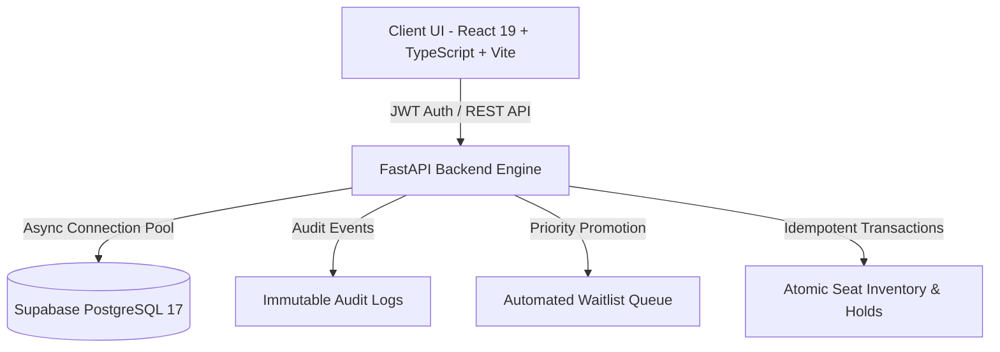

# ✈️ SkyFlow — Real-Time Flight Management & Booking Platform

[](https://fastapi.tiangolo.com)
[](https://react.dev)
[](https://www.typescriptlang.org/)
[](https://supabase.com)
[](https://tailwindcss.com)

**SkyFlow** is an enterprise-grade airline reservation and operations management system. It features real-time seat inventory mapping, atomic 15-minute seat-hold guarantees, automated waitlist priority queues, flexible cancellation & refund engines, and an operations console for flight scheduling and audit logging.

---

## 🌟 System Architecture & Features



### 1. 🔐 Authentication & Access Control (RBAC)
* **JWT Bearer Token Authentication** with automatic expiration handling.
* **Strict Route Guards (`<ProtectedRoute />`)**: All booking, search, and management features require authentication.
* **Three Role Tiers**:
  * `SUPER_ADMIN`: Full operations access, flight dispatch, scheduling, and audit log inspection.
  * `OPS_AGENT`: Flight schedule updates, waitlist overview, and refund disbursements.
  * `PASSENGER`: Flight search, cabin seat selection, temporary holds, and self-service cancellations.

### 2. 💺 Dynamic Cabin Inventory & Seat Mapping
* Visual seat grid supporting **First Class**, **Business Class**, and **Economy Class**.
* Real-time seat statuses: `AVAILABLE`, `HELD`, `BOOKED`, `BLOCKED`.
* Configurable fare types:
  * **Basic Fare**: Non-refundable, strict fare rules.
  * **Flexible Fare**: 100% value converted into reusable Travel Credits (12-month validity).
  * **Refundable**: Standard cash reimbursement minus processing fee.

### 3. ⏳ Atomic Seat Holds & Idempotency
* **15-Minute Seat Hold Lock**: Prevents race conditions and double-booking during checkout.
* **Idempotent Writes**: All critical transactions (`Idempotency-Key`) ensure zero duplicate charges or holds on network retries.

### 4. 📋 Automated Waitlist Priority Queue
* Automated priority scoring algorithm based on loyalty tier (`PLATINUM`, `GOLD`, `SILVER`, `BRONZE`) and registration timestamp.
* Instant re-allocation and promotion when seats are released from cancelled holds.

### 5. 💰 Automated Refunds & Travel Credits
* Operations queue for reviewing, escalating, and approving cash refunds.
* Automated travel credit issuance with instant passenger ledger updates.

### 6. 📊 Operations Dashboard & Audit Trail
* Real-time metrics: active flights, passenger load factor, held seat count, pending refunds.
* Complete immutable audit logs tracking actor ID, action, state before/after, and reason.

---

## 📂 Project Structure

```text
Hackathon/
├── app/                        # FastAPI Backend Application
│   ├── config.py               # Environment & business rule settings
│   ├── database.py             # Async SQLAlchemy 2.0 connection pooler
│   ├── dependencies/           # Auth and session dependencies
│   ├── exceptions/             # Global error handlers
│   ├── models/                 # PostgreSQL schema models (SQLAlchemy)
│   ├── routers/                # API route endpoints
│   │   ├── admin_flights.py    # Admin operations & inventory management
│   │   ├── auth.py             # Login, register, refresh tokens
│   │   ├── bookings.py         # Hold creation & confirmation
│   │   ├── flights.py          # Search & seat map retrieval
│   │   ├── refunds.py          # Refund processing queue
│   │   └── waitlist.py         # Priority waitlist management
│   └── services/               # Core business logic services
│
├── frontend/                   # React 19 Frontend Client
│   ├── src/
│   │   ├── api/                # Axios API client & endpoints
│   │   ├── components/         # Reusable UI components & modals
│   │   │   ├── admin/          # Admin modals & metric cards
│   │   │   ├── booking/        # Seat map & fare selection cards
│   │   │   ├── layout/         # Navbar, Sidebar & Protected Routes
│   │   │   └── ui/             # Badges, loaders, confirm dialogs
│   │   ├── context/            # AuthContext & ToastContext
│   │   ├── pages/              # Application views
│   │   │   ├── admin/          # Flights, bookings, refunds, audit logs
│   │   │   ├── auth/           # Login & Register views
│   │   │   └── passenger/      # Search, details, checkout, my bookings
│   │   ├── types/              # TypeScript interfaces & DTO schemas
│   │   └── utils/              # Formatters & airport databases
│   ├── package.json
│   └── vite.config.ts
│
├── requirements.txt            # Python dependencies
├── .env.example                # Backend environment template
└── README.md                   # Project documentation
```

---

## 🚀 Quick Start Guide

### Prerequisites
* **Python**: 3.11+
* **Node.js**: 18+ (Node 20+ recommended)
* **PostgreSQL Database** (Supabase connection string)

---

### Step 1: Backend Setup (FastAPI)

1. **Navigate to root directory and create virtual environment:**
   ```bash
   python -m venv .venv
   # Windows:
   .venv\Scripts\activate
   # Linux/macOS:
   source .venv/bin/activate
   ```

2. **Install backend dependencies:**
   ```bash
   pip install -r requirements.txt
   ```

3. **Configure environment variables:**
   Create a `.env` file in the root directory:
   ```env
   DATABASE_URL=postgresql+asyncpg://postgres.[REF]:[PASSWORD]@[HOST]:6543/postgres
   SECRET_KEY=your_super_secret_jwt_key_here
   ALGORITHM=HS256
   ACCESS_TOKEN_EXPIRE_MINUTES=30
   REFRESH_TOKEN_EXPIRE_DAYS=7
   HOLD_EXPIRY_MINUTES=15
   ENVIRONMENT=development
   ```

4. **Start the FastAPI backend server:**
   ```bash
   python -m uvicorn app.main:app --host 127.0.0.1 --port 8000 --reload
   ```
   * **API Base URL:** `http://127.0.0.1:8000`
   * **Swagger Interactive Docs:** `http://127.0.0.1:8000/docs`
   * **ReDoc Documentation:** `http://127.0.0.1:8000/redoc`

---

### Step 2: Frontend Setup (React + Vite)

1. **Navigate to the frontend directory:**
   ```bash
   cd frontend
   ```

2. **Install Node dependencies:**
   ```bash
   npm install
   ```

3. **Configure frontend environment:**
   Create `frontend/.env`:
   ```env
   VITE_API_BASE_URL=http://127.0.0.1:8000
   ```

4. **Start the Vite development server:**
   ```bash
   npm run dev
   ```
   * **Frontend Local URL:** `http://localhost:5173/`

5. **Build for production:**
   ```bash
   npm run build
   ```

---

## 🔑 Demo Login Credentials

The application provides quick role-fill buttons on the `/login` page:

| Role | Email | Password | Access Level |
| :--- | :--- | :--- | :--- |
| **Super Admin** | `admin@skyflow.com` | `AdminPass123!` | Full System, Flight Creation, Audit Logs |
| **Operations Agent** | `ops@skyflow.com` | `OpsPass123!` | Flight Management, Refunds, Waitlist |
| **Passenger** | `passenger@skyflow.com` | `Pass123!` | Flight Booking, Seat Selection, My Bookings |

---

## 🛡️ Key API Endpoints Reference

| Method | Endpoint | Description | Auth Required |
| :--- | :--- | :--- | :--- |
| `POST` | `/auth/register` | Register new user account | Public |
| `POST` | `/auth/login` | Login and retrieve JWT access token | Public |
| `GET` | `/flights/search` | Search flights with dates & origin/destination | User |
| `GET` | `/flights/{id}/seat-map` | Retrieve visual seat occupancy map | User |
| `POST` | `/bookings/hold` | Create 15-min atomic seat hold (`Idempotency-Key`) | User |
| `POST` | `/bookings` | Confirm booking & issue ticket | User |
| `POST` | `/bookings/{ref}/cancel` | Cancel booking with refund/credit rules | User |
| `POST` | `/waitlist` | Join priority waitlist queue for full flight | User |
| `GET` | `/admin/flights` | List and filter all flights | Admin / Ops |
| `POST` | `/admin/flights` | Create and dispatch new flight schedule | Super Admin |
| `GET` | `/admin/refunds` | Process and disburse customer refund claims | Admin / Ops |
| `GET` | `/admin/audit-logs` | Retrieve immutable operational audit trail | Super Admin |

---

## 📄 License

This project is licensed under the MIT License — see the [LICENSE](LICENSE) file for details.
